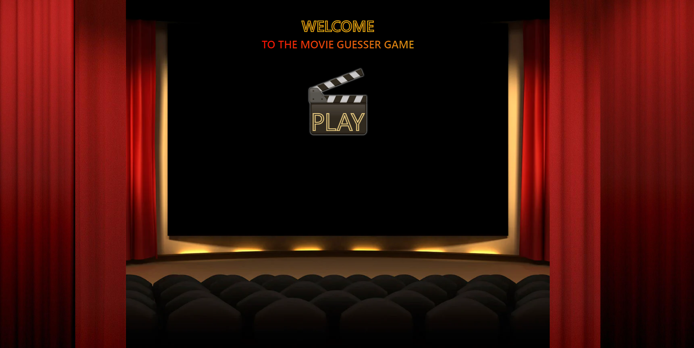
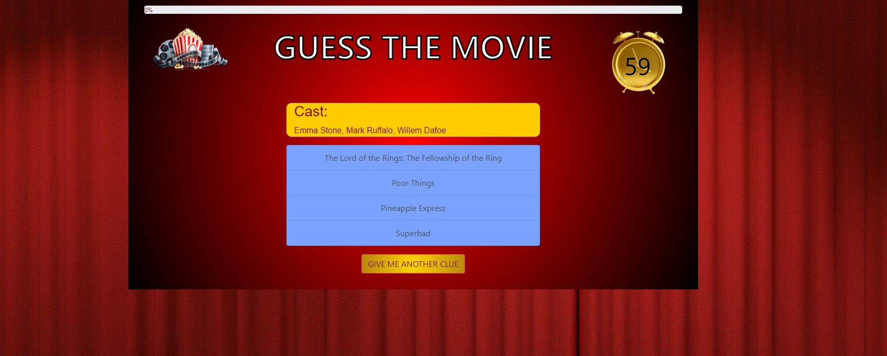
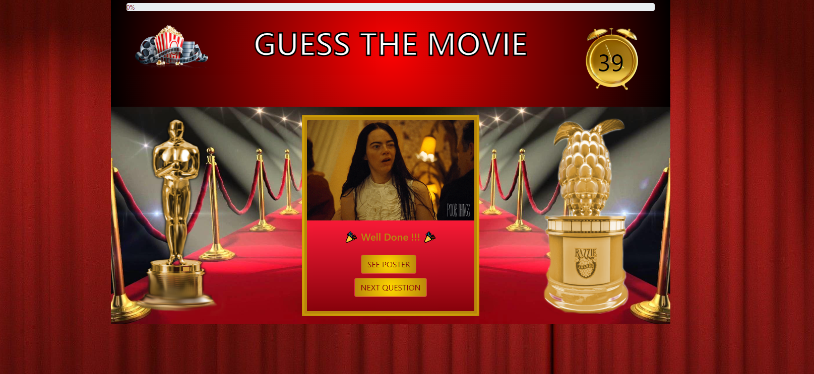
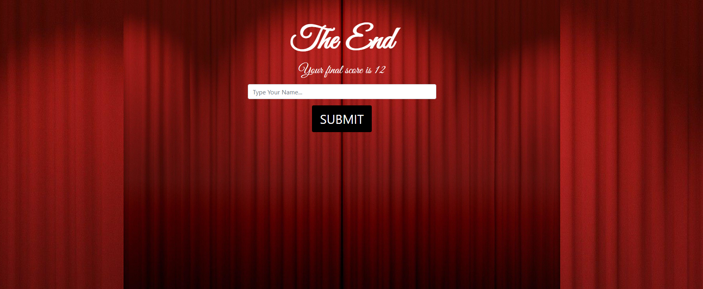

# Guess-The-Movie 📽 🍿
Welcome to the Movie Guessing Game! This is a fun and interactive web-based game where players guess the title of a movie based on clues provided.

## Description

The Movie Guessing Game is a web application designed to entertain users by testing their knowledge of movies. The game presents players with a series of questions, each containing clues related to a specific movie. Players must guess the correct movie title based on the clues provided within a time limit.

**Features of Guess The Movie:**

- Interactive gameplay with timer functionality.
- Multiple levels of difficulty with increasing complexity.
- Clues provided to help players guess the movie title.
- Feedback provided after each answer.
- Leaderboard to track high scores.
- Responsive design for seamless gameplay on various devices.

## Table of Contents

- [Description](#description)
- [Usage](#usage)
- [Instructions](#instructions)
- [Technologies](#technologies)
- [Credits](#credits)
- [License](#license)

## Usage

To play the Movie Guessing Game, simply visit the game's website <a href="https://reececorkhill.github.io/Guess-The-Movie/"> here</a> !

## Instructions

- Start the game by clicking the "PLAY" button.
- Guess the movie title based on the clues provided.
- Use the "Give me another clue" button to reveal additional clues if needed.
- Select your answer from the available options.
- Receive feedback on your answer.
- Proceed to the next question until all questions are answered.
- Submit your name and score to the leaderboard at the end of the game.

## Technologies

- HTML
- CSS (Bootstrap)
- JavaScript (jQuery)
- APIs (OMDB, Giphy)
- Local Storage

## Credits

- <a href="https://github.com/Artur158">Artur158</a> | HTML and CSS
- <a href="https://github.com/designs-by-kate">designs-by-kate</a> | HTML and CSS
- <a href="https://github.com/nicosharpe">nicosharpe</a> | JavaScript
- <a href="https://github.com/reececorkhill">reececorkhill</a> | JavaScript and API

## License

MIT License

Copyright (c) 2024 reececorkhill

Permission is hereby granted, free of charge, to any person obtaining a copy of this software and associated documentation files (the "Software"), to deal in the Software without restriction, including without limitation the rights to use, copy, modify, merge, publish, distribute, sublicense, and/or sell copies of the Software, and to permit persons to whom the Software is furnished to do so, subject to the following conditions:

The above copyright notice and this permission notice shall be included in all copies or substantial portions of the Software.

THE SOFTWARE IS PROVIDED "AS IS", WITHOUT WARRANTY OF ANY KIND, EXPRESS OR IMPLIED, INCLUDING BUT NOT LIMITED TO THE WARRANTIES OF MERCHANTABILITY, FITNESS FOR A PARTICULAR PURPOSE AND NONINFRINGEMENT. IN NO EVENT SHALL THE AUTHORS OR COPYRIGHT HOLDERS BE LIABLE FOR ANY CLAIM, DAMAGES OR OTHER LIABILITY, WHETHER IN AN ACTION OF CONTRACT, TORT OR OTHERWISE, ARISING FROM, OUT OF OR IN CONNECTION WITH THE SOFTWARE OR THE USE OR OTHER DEALINGS IN THE SOFTWARE.
